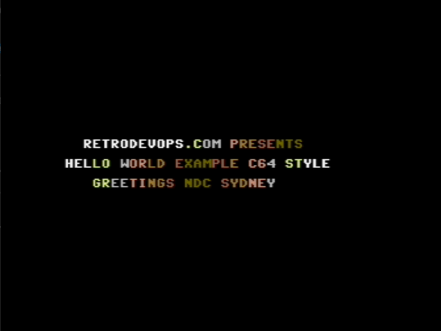

# Retro Devops - Hello World 80's Style

This project containes nativve Commodore 64 asembly language for a 1980's
style "hello world" program. It is part of the [Retrodevops project][retrodevops] that aims to prove any technology can be made better with a little DevOps.

## Helloworld 1

The first helloworld program is based on the excellent [Dust Layer Tutorials](https://dustlayer.com/c64-coding-tutorials/2013/2/17/a-simple-c64-intro) and demonstrates how to:

1. Displays Text to Screen
1. Applies a colourwash effect to the text
1. Play a SID music file

Reviewing the code in this project provides a good introduction to assembly coding on the Commodore 64!!

## Helloworld 2

The second hellowworld program is based on is based on the excellent C64 demo coding tutorials found at [http://tnd64.unikat.sk](http://tnd64.unikat.sk) adds some advanced techniques including:

1. Horizontal text scrolling!
1. Dividing the screen into multiple areas
1. Using a custom chraracter set.

## See a demo

If you just want to see these demos in action jump over to the [Retrodevops Online C64][online-c64] and use the drop down list to select one of the demo disk images and the click "Load and Play".
If you don't hear any *sound* click on "Controls" and make sure sound is enabled.

[online-c64]: https://www.retrodevops.com/c64.html
[retrodevops]: https://www.retrodevops.com
